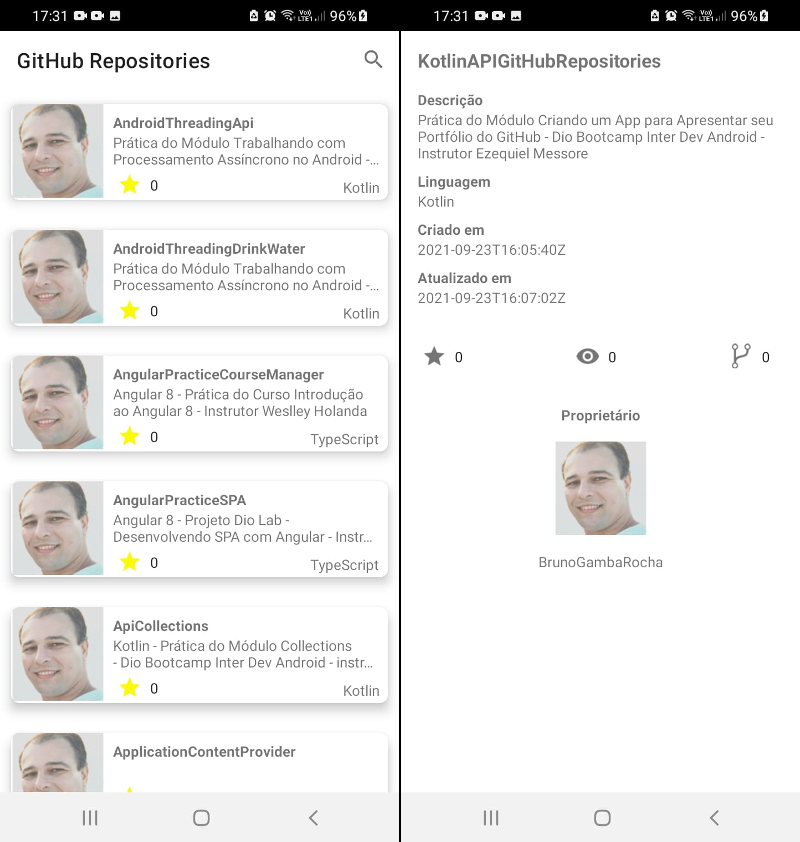

# Kotlin API GitHub Repositories

- Instrutor: [Ezequiel Messore](https://www.linkedin.com/in/ezequielmessore)
- Repositório original: [app-repositories](https://github.com/EzequielMessore/app-repositories)
- Plataforma de Ensino: [Digital Innovation One](https://digitalinnovation.one/sign-up?ref=K5EF2VCVKA)
- Módulo Criando um App para Apresentar seu Portfólio do GitHub - Dio Bootcamp Inter Dev Android

## Vídeo Explicativo

  [Youtube](https://youtu.be/6gWQsVBFJoA)

##  Objetivo

- Aplicação destinada à prática do módulo "Criando um App para Apresentar seu Portfólio do GitHub".
- Exibir uma lista de objetos recebidos pela API do GitHub.
- Implementada a exibição dos detalhes do repositório selecionado.

## Tecnologias Utilizadas

- [Kotlin](https://kotlinlang.org/docs/getting-started.html)
- [Jetpack](https://developer.android.com/jetpack)
- [MVVM](https://developer.android.com/jetpack/guide?gclid=CjwKCAiAjp6BBhAIEiwAkO9Wut2W9TLNRaql75qE26vP_xRvCfTBlBY5j8RHxc_r6RhC1HFPTprbwRoC32cQAvD_BwE&gclsrc=aw.ds)
- [API REST GitHub](https://docs.github.com/pt/rest)
- [Retrofit](https://square.github.io/retrofit)
- [Injeção de Dependência](https://medium.com/collabcode/inje%C3%A7%C3%A3o-de-depend%C3%AAncia-no-kotlin-com-koin-4d093f80cb63)
- [sampledata](https://developer.android.com/studio/write/tool-attributes#toolssample_resources)
- [Material Chip](https://material.io/components/chips/android#using-chips)
- [Glide](https://github.com/bumptech/glide)

## Conteúdo apresentado

Criar um APP de listagem de repositórios do GitHub, utilizando uma arquitetura robusta e testável por meio do padrão estrutural MVVM.

- Aula 01: Apresentação pessoal e apresentação do curso
	- Apresentação

- Aula 02: Apresentando o projeto base
	- Conhecendo nosso Projeto Base (MVVM)
	- Criando nossa interface
	- Integração com uma API REST: GitHub API

- Aula 03: Apresentação da GitHub API
	- API de REST do GitHub

- Aula 04: Criando listagem de itens
	- sampledata
	- Material Chip

- Aula 05: Criando nosso Menu

- Aula 06: Criando Data Module

- Aula 07: Criando Domain Module

- Aula 08: Um pouco sobre View Model

- Aula 09: Finalizando nosso app
	- Glide

## Desafio proposto

- Crie um App Android para apresentar seu portfólio de projetos do GitHub de maneira elegante e simplificada.
- Nesse contexto, você passará por todo o processo de desenvolvimento usando o Kotlin, uma das linguagens de programação de maior ascensão nos últimos anos.
- Por fim, você é desafiado a entregar seu próprio projeto, incorporando suas próprias evoluções e melhorias! Está preparado?

## Pesquisa Complementar

- [Sample Data](https://segunfamisa.com/posts/sample-data-with-android-studio)
- [RecyclerView](https://developer.android.com/guide/topics/ui/layout/recyclerview)
- [RecyclerView Sample](https://github.com/android/views-widgets-samples/tree/main/RecyclerViewKotlin/)

## Autor

- Bruno Gamba Rocha
- https://www.linkedin.com/in/bruno-gamba-rocha